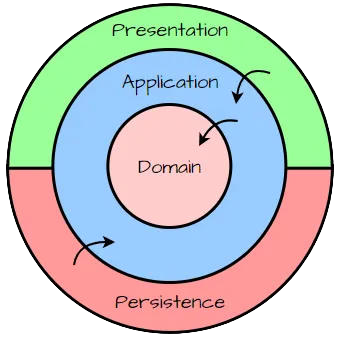

# `<Your Project Name>`

`<Project Description>`

- [Clean Architecture with ASP.NET Core](#clean-architecture-with-aspnet-core)
- [Architecture Overview](#architecture-overview)
- [Dependency Flow](#dependency-flow)
- [Database & Persistence](#database--persistence)
- [Key Concepts Used](#key-concepts-used)
- [Getting Started](#getting-started)
- [Setup Steps](#setup-steps)
- [Commands](#commands)
- [Notes](#notes)

## Clean Architecture with [ASP.NET Core](http://ASP.NET)

This repository implements a Clean Architecture implementation using [ASP.NET Core](http://ASP.NET) Web API.
The goal is to provide a scalable, maintainable, and testable foundation that can be reused across different projects.



## Architecture Overview

The solution is structured into four main projects, following Clean Architecture principles:

```
<YourSolutionName>
│
├── <YourSolutionName>.Api
│   ├── Endpoints/
│   └── Middleware/
|
├── <YourSolutionName>.Application
│   ├── DTOs/
│   ├── Features/
│   │   ├── FeatureOne/
│   │   ├── FeatureTwo/
│   │   └── FeatureThree/
│   └── Utilities/
|
├── <YourSolutionName>.Domain
│   ├── Entities/
│   ├── Interfaces/
│   ├── Options/
│   └── ValueObjects/
|
└── <YourSolutionName>.Infrastructure
    ├── External/
    ├── Persistence/
    |    ├── Migrations/
    │    |── Repositories/
    │    |── AppDbContext.cs
    |    └── AppDbContextFactory.cs
    └── Services/
```

### 1. API Layer (`*.Api`)

**Presentation layer**

- Entry point of the application
- Handles HTTP requests and responses
- Configures middleware and dependency injection
- Should not contain business logic

### 2. Application Layer (`*.Application`)

**Application layer**

- Contains application logic and use cases
- Implements **CQRS (Command Query Responsibility Segregation)**
- Defines commands and queries
- Typically uses **MediatR** similar patterns like custom made **SimpleMediator**
- Depends only on the Domain layer

### 3. Domain Layer (`*.Domain`)

**Core domain**

- Contains business entities and rules
- Defines repository interfaces (contracts)
- Completely independent from frameworks
- No dependency on external libraries (e.g., [EF Core](https://learn.microsoft.com/en-us/ef/core/), [ASP.NET Core](http://ASP.NET) )

### 4. Infrastructure Layer (`*.Infrastructure`)

**Infrastructure layer**

- Handles external concerns (e.g., database, file system, APIs)
- Implements repository interfaces
- Contains ORM configuration (e.g., Entity Framework Core)
- Includes DbContext and migrations
- Depends on the Application layer

## Dependency Flow

```
Api → Application → Domain
Api → Infrastructure → Application → Domain
```

- Dependencies always point inward
- Outer layers depend on inner layers
- Inner layers must not depend on outer layers

## Database & Persistence

- ORM: (e.g., Entity Framework Core)
- Database: (e.g., SQL Server / PostgreSQL / MySQL)
- Migration strategy: Code-first / Database-first
- All persistence logic resides in the **Infrastructure** layer

## Key Concepts Used

- Clean Architecture
- Separation of Concerns
- Dependency Injection
- Repository Pattern
- CQRS (Commands & Queries)
- Mediation Pattern (e.g., MediatR / SimpleMediator)
- ORM (e.g., Entity Framework Core)
- [ASP.NET Core](http://ASP.NET) Web API

## Getting Started

**Prerequisites**

- .NET SDK (version according to the project)
- Database (e.g., SQL Server / PostgreSQL)
- IDE: Visual Studio / VS Code

## Setup Steps

Here are the general steps to run a .NET project:

### 1. Clone the repository

```shell
git clone <repository-url>
cd <folder-name>

# Open the solution in your IDE (e.g., VS Code)
code .
```

### 2. Check .NET SDK version

Make sure the SDK version matches the project requirement:

```shell
dotnet --version
```

If it doesn’t match, install the required version.

### 3. Restore dependencies

```shell
dotnet restore
```

### 4. Build the project

```shell
dotnet build
```

### 5. Run the project

If you know the main project (e.g., Web API):

```shell
dotnet run --project <path-to-project.csproj>
```

Or if you are already inside the project folder:

```shell
dotnet run
```

### 6. (Optional) Apply database migrations

If the project uses Entity Framework:

```shell
# Windows PowerShell
Update-Database

# macOS Terminal
dotnet ef database update --project CleanArchitecture.Api
```

## Commands

### Add Migrations

```shell
# Windows PowerShell
Add-Migration <MigrationName>

# macOS Terminal
dotnet ef migrations add <MigrationName> \
 --project <YourSolutionName>.Infrastructure \
 --startup-project <YourSolutionName>.Api \
 --output-dir Persistence/Migrations
```

#### `AppDbContext.cs` example

```C#
using CleanArchitecture.Domain.Entities;
using Microsoft.EntityFrameworkCore;

namespace CleanArchitecture.Infrastructure.Persistence;

public class AppDbContext(DbContextOptions<AppDbContext> options) : DbContext(options)
{
    public DbSet<UserEntity> Users { get; set; }
}
```

#### `AppDbContextFactory.cs` example

```C#
using Microsoft.EntityFrameworkCore;
using Microsoft.EntityFrameworkCore.Design;
using Microsoft.Extensions.Configuration;

namespace CleanArchitecture.Infrastructure.Persistence;

public class AppDbContextFactory
    : IDesignTimeDbContextFactory<AppDbContext>
{
    public AppDbContext CreateDbContext(string[] args)
    {
        var basePath = Directory.GetCurrentDirectory();

        var configuration = new ConfigurationBuilder()
            .SetBasePath(basePath)
            .AddJsonFile("appsettings.json", optional: false)
            .Build();

        var optionsBuilder = new DbContextOptionsBuilder<AppDbContext>();

        optionsBuilder.UseSqlServer(
            configuration.GetConnectionString("DefaultConnection")
        );

        return new AppDbContext(optionsBuilder.Options);
    }
}
```

### Upgrade Outdated Packages

#### 1. Install the tool:

```shell
dotnet tool install --global dotnet-outdated-tool
```

#### 2. Run it in the solution root:

```shell
dotnet outdated
```

#### 3. Automatically update all packages:

```shell
dotnet outdated --upgrade
```

📌 For a safer approach (to avoid major breaking changes):

```shell
dotnet outdated --upgrade --version-lock Minor
```

👉 Meaning:
Minor → update only minor & patch versions
Major → update all versions (higher risk)

## Notes

- Rename `<YourSolutionName>` with this script command:

  ```shell
  chmod +x rebrand-dotnet.sh
  ./rebrand-dotnet.sh CleanArchitecture <YourSolutionName>
  ```

- Adjust database provider and tools based on your stack
- Extend layers as needed (e.g., adding Shared/Common project)
